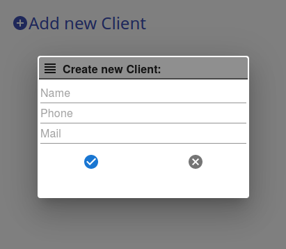
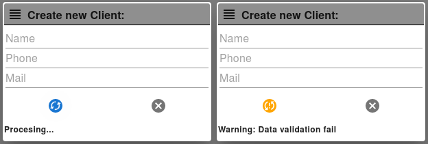
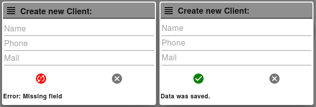

# React Multi State Submit Button

A multistate submit button that interactuate according API response. For demostration the button is used in a dialog example.

The API interaction of the dialogue will be made with Axios and managed by Redux thunk.
The dialog make the API request with Axios, if the API response is Success it close by self, if not error advices are showed.

For dialog and icons will use MATERIAL-UI library.

The button have four states:  **normal,  warning, error, success**

